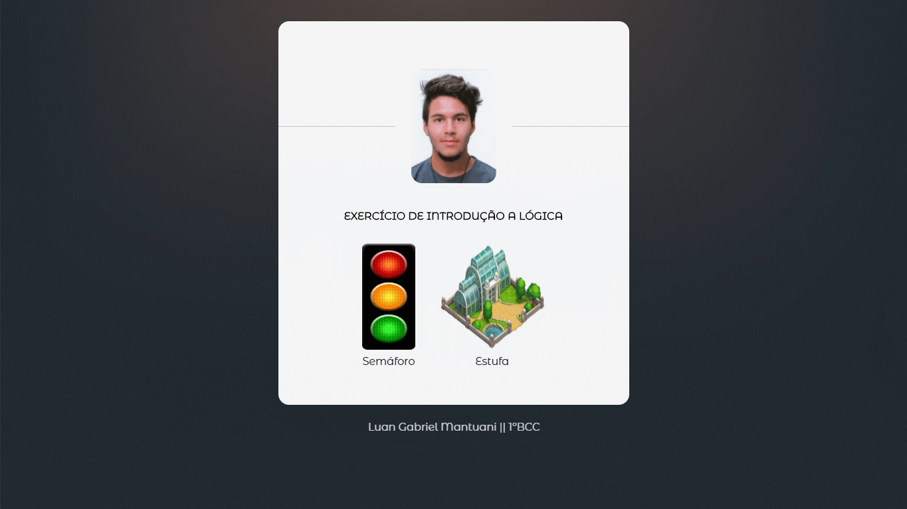
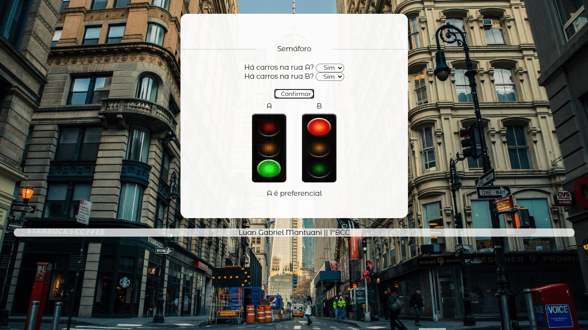
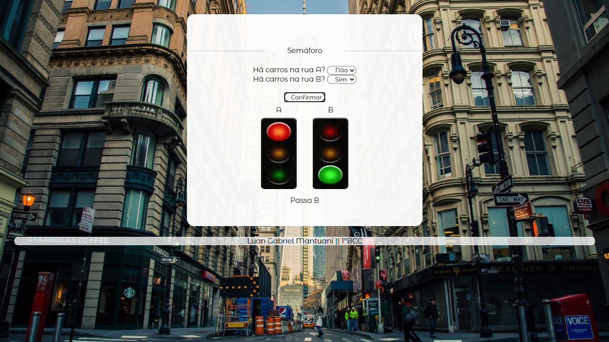
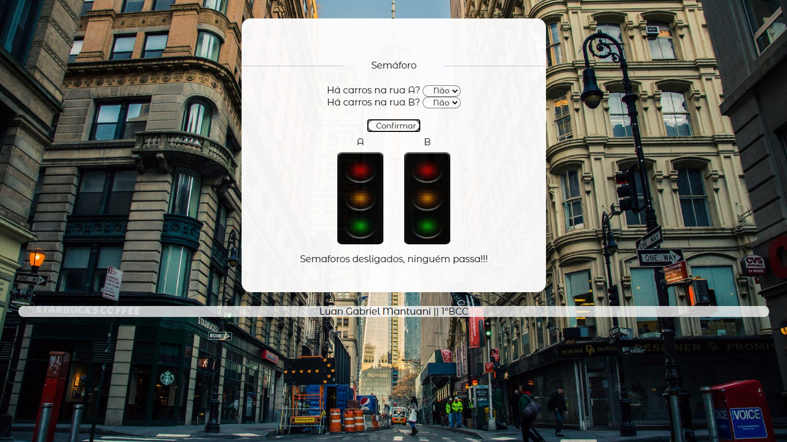
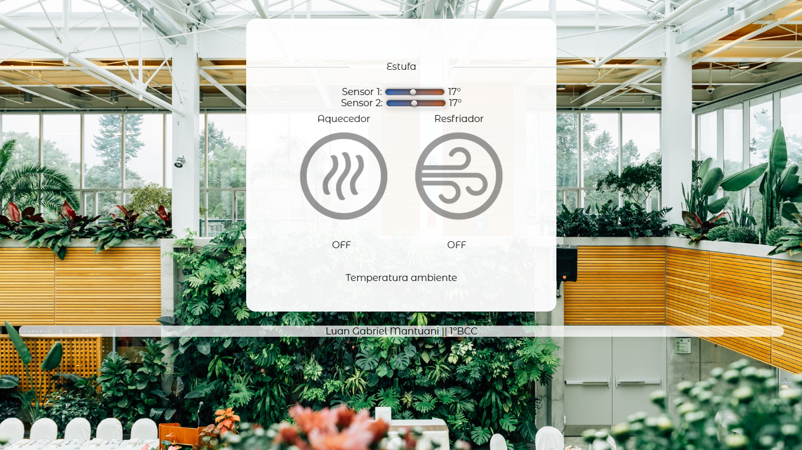

# Implementação dos exercícios de lógica

## Semáforo
- Neste exercício deve ser definida a preferência para a rua A ou B baseando-se na presença de carros em uma delas.

## Estufa
- Neste exercício o aquecedor ou o resfriador da estufa devem ser ligados com base na temperatura detectada por dois sensores.

